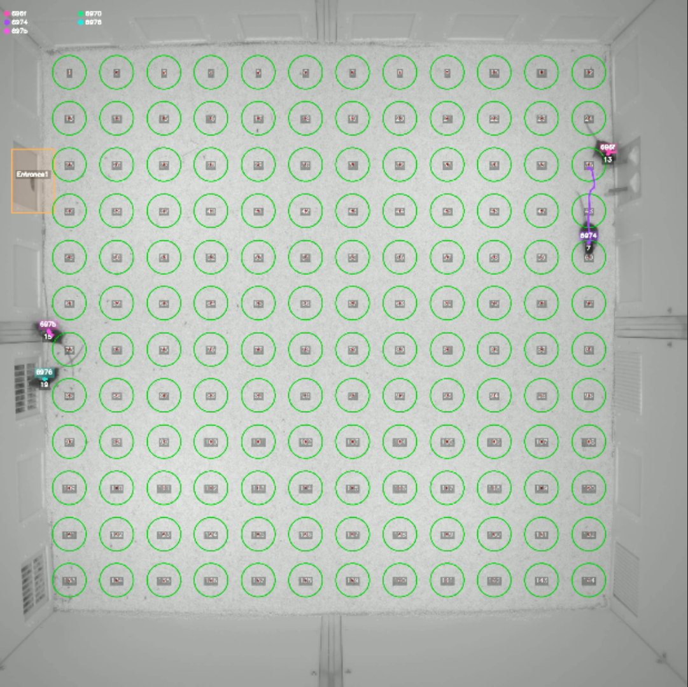

# DeepLabCut Extended Tracking Branch

This branch builds on the upstream [DeepLabCut](https://github.com/DeepLabCut/DeepLabCut) project to explore enhanced tracking capabilities.

## Core Extensions

### Velocity-gated ellipse tracker

The tracker predicts subject motion and rejects unlikely matches by gating associations in both speed and space, yielding more robust identities than the default ellipse tracker when animals move quickly or cross paths.

### RFID-assisted long-term tracking

Integrating radio-frequency identification hardware allows antennas around the arena to read implanted tags. These reads periodically correct identities, enabling reliable long-term tracking even after extended occlusions or absences.

## Relationship to DeepLabCut

All features remain compatible with standard DeepLabCut projects, models, and APIs. Users can train networks and run analyses with the usual commands while opting into these tracking modules when needed. For installation details, tutorials, and the broader feature set, please consult the official [DeepLabCut documentation](https://github.com/DeepLabCut/DeepLabCut).

More information about the project please go to https://github.com/Chap5732/DeepLabCut/tree/feat/velocity-gating/deeplabcut/rfid_tracking and [https://github.com/Chap5732/DeepLabCut/edit/feat/velocity-gating/deeplabcut/rfid_tracking/README.md](https://github.com/Chap5732/DeepLabCut/blob/feat/velocity-gating/deeplabcut/rfid_tracking/README.md)
