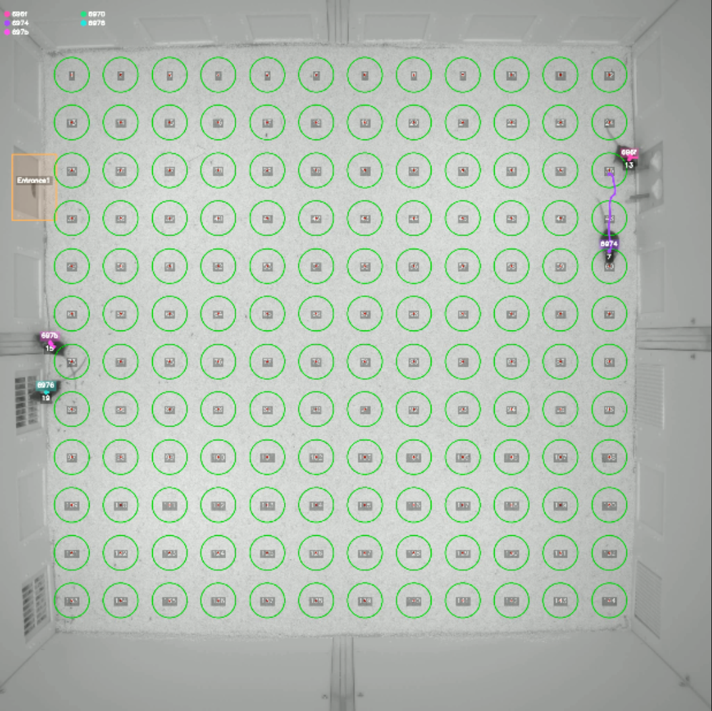

# DeepLabCut 扩展追踪分支（RFID DLC 追踪项目）



本分支在官方 [DeepLabCut](https://github.com/DeepLabCut/DeepLabCut) 基础上扩展了追踪能力，主要包含：

- **速度门控椭圆追踪器**：通过速度与空间的双重门控预测并拒绝不合理匹配，在动物快速移动或交叉时仍能保持身份稳定。
- **RFID 辅助的长期追踪**：在场地周围布设读卡器周期性校正身份，即便长时间遮挡也能维持准确追踪。

所有功能与标准 DeepLabCut 项目和 API 兼容，更多使用教程可参见官方文档。

## 安装与环境准备

```bash
git clone https://github.com/Chap5732/DeepLabCut.git
cd DeepLabCut
git checkout feat/velocity-gating
pip install -e .
```

## 项目结构

```
project/
├── __init__.py                           # 便捷调用入口
├── config.py                             # 默认路径与门控参数
├── pipeline.py                           # 串联各处理步骤的主流程
├── run_pipeline.py                       # 命令行运行完整流程
├── match_rfid_to_tracklets.py            # RFID 与 tracklet 匹配
├── reconstruct_from_pickle.py            # 轨迹重建脚本
├── make_video.py                         # 视频可视化脚本
├── io.py                                 # 输入输出辅助函数
├── utils.py                              # 核心工具函数库
├── visualization.py                      # 绘图与显示工具
├── convert_detection2tracklets.py        # 检测结果转 tracklets
├── convert_detection2tracklets_config.yaml  # 默认参数
├── roi_definitions.json                  # ROI 区域定义文件
├── scripts/                              # 示例运行脚本
└── README.md                             # 项目说明
```

## 功能概述

### 1. 轨迹重建 (`reconstruct_from_pickle.py`)
- 基于RFID标签信息重建完整的动物移动轨迹
- 以已有RFID标签的tracklet为锚点
- 通过最近邻距离算法连接前后时间段的tracklet
- 输出重建后的pickle文件和链段信息CSV

**核心算法：**
- 锚点选择：选择有RFID标签且命中次数≥阈值的tracklet
- 双向扩展：从锚点向前/向后贪心连接距离最近的tracklet
- 时间约束：只连接时间间隔在指定范围内的tracklet

### 2. 视频可视化 (`make_video.py`)
- 在原视频上叠加各种追踪信息
- 支持显示tracklet轨迹、RFID事件、重建后的身份链
- 可选绘制读卡器位置和ROI区域
- 生成带有图例的可视化视频

**可视化元素：**
- Tracklet轨迹：彩色轨迹线和ID标签
- RFID事件：标签检测事件提示
- 身份链：重建后的完整轨迹
- 读卡器：RFID读卡器位置标记
  - 默认绿圈显示；若当帧某读卡器读取到标签，其圆圈将高亮为黄色
- ROI区域：感兴趣区域边界

### 3. 工具函数库 (`utils.py`)
包含所有共用的核心函数：
- **数据I/O**：pickle文件加载/保存
- **DLC处理**：帧索引提取、身体中心计算
- **可视化**：颜色生成、读卡器绘制、ROI绘制
- **几何计算**：ROI命中测试、距离计算

## 标签分配与轨迹重建原理

### 标签分配原理
`match_rfid_to_tracklets.py` 模块负责将读卡器逐次捕获到的标签分配给对应 tracklet。核心流程如下：

1. **时空匹配**
   - 每条 RFID 记录首先根据 `MRT_RFID_FRAME_RANGE` 对齐到最近的视频帧；只有在这一帧及其前后给定帧数内出现的 tracklet 才会被考虑。
   - 以读卡器的几何中心为圆心，搜索半径为 `MRT_COIL_DIAMETER_PX / 2 + MRT_HIT_MARGIN` 的范围；候选轨迹需在圆内至少命中一次。

2. **候选筛选**
   - 轨迹末端关键点的 `p` 值必须高于 `MRT_PCUTOFF`；
   - 若启用 `MRT_UNIQUE_NEIGHBOR_ONLY`，要求在该半径内只有唯一 tracklet；否则会比较最邻近的两个候选，若距离差小于 `MRT_AMBIG_MARGIN_PX` 则判为歧义。

3. **标签确认**
   - 为每条 tracklet 统计各标签的命中次数，要求命中总数 ≥ `MRT_TAG_MIN_READS` 且主标签占比 ≥ `MRT_TAG_DOMINANT_RATIO`。
   - 对于低命中但高纯度的情况，可通过 `MRT_LOW_READS_HIGH_PURITY_ASSIGN` 与 `MRT_LOW_READS_PURITY_THRESHOLD` 进行宽松分配。
   - 最终把确认的标签写入节点的 `tag` 字段，同时记录 `rfid_counts` 和具体命中帧。

### 轨迹重建原理
`reconstruct_from_pickle.py` 以带标签的 tracklet 作为锚点，在整个时间轴上同步推进，构建连续的身份链：

1. **锚点筛选**
   - 只有标签命中次数 ≥ `ANCHOR_MIN_HITS` 的 tracklet 才被视为可靠锚点；它们按照起始时间排序并作为“水源”同时向两侧扩散。

2. **时间–速度门控**
   - 为每个活跃锚点计算其波前位置（头/尾中心）；仅在时间间隔 `≤ MAX_GAP_FRAMES` 且位移 `d ≤ V_GATE_CMS × gap / (FPS / PX_PER_CM)` 的候选 tracklet 才会被纳入候选池。
   - 候选的代价定义为 `d + EPS_GAP × gap`，越小越优先。

3. **同步推进与冲突裁决**
   - 所有锚点同时提名各自代价最低的候选，如果同一个 tracklet 被多个锚点竞争，则按代价从小到大依次决策。
   - 若最佳与次佳代价之差小于 `δ = min(DELTA_PX_CAP, DELTA_PROP × 上限位移)`，则判为歧义并冻结该候选，等待下一轮。
   - 被选中的轨迹加入对应身份链，源锚点的波前移动到新轨迹末端；若某方向候选耗尽，则该波前终止。

4. **近锚点堤坝**
   - 若同一标签在传播方向的 `MAX_GAP_FRAMES` 内已存在另一个锚点，则当前锚点不再越界扩张，以避免跨越可靠锚点造成错误连接。

经过多轮推进后，所有波前都停止，最终得到多条无冲突的身份链，可用于后续可视化或行为分析。

## 使用方法

由于 `config.py` 中相关路径的默认值均为 `None`，运行前需通过命令行
或 YAML 文件提供实际文件路径。下面给出一个最小示例：

```yaml
# paths.yaml
VIDEO_PATH: /path/to/video.mp4
MRT_RFID_CSV: /path/to/rfid.csv
MRT_CENTERS_TXT: /path/to/readers_centers.txt
MRT_TS_CSV: /path/to/timestamps.csv
```

```bash
python run_pipeline.py config.yaml /path/to/video.mp4 /path/to/rfid.csv \
    /path/to/readers_centers.txt /path/to/timestamps.csv --config_override paths.yaml
```

### 启用速度/空间门控

速度（`velocity_gate_cms`）与空间（`max_px_gate`）门控可在将检测结果转为 tracklets 时过滤不合理移动，从而提升身份稳定性。可在 YAML 文件中同时设置门控与相机参数：

```yaml
# gating.yaml
velocity_gate_cms: 80      # cm/s
px_per_cm: 14              # 像素/厘米
fps: 30
max_px_gate: 200           # px
```

随后在命令行调用时通过 `--config_override` 加载该文件：

```bash
python run_pipeline.py config.yaml video.mp4 rfid.csv centers.txt ts.csv \
    --config_override gating.yaml
```

`run_pipeline.py` 默认以 INFO 级别输出日志；若在自定义脚本中调用 `run_pipeline()`，请先配置：

```python
import logging
logging.basicConfig(level=logging.INFO)
```

当门控参数正确加载后，日志中会出现以下信息，表明速度与空间门控已启用：

```
INFO deeplabcut.pose_estimation_pytorch.apis.tracklets: Velocity gating enabled with threshold 37.33 px/frame
INFO deeplabcut.pose_estimation_pytorch.apis.tracklets: Spatial gating enabled with max distance 200 px
```

### 一键全流程分析
```python
from deeplabcut import run_rfid_pipeline

run_rfid_pipeline(
    config_path="path/to/config.yaml",
    video_path="path/to/video.mp4",
    rfid_csv="path/to/rfid.csv",
    centers_txt="path/to/readers_centers.txt",
    ts_csv="path/to/timestamps.csv",
    shuffle=1,                        # DLC 模型 shuffle 编号
    destfolder="path/to/output",  # 可选；若省略则使用 ``config.DESTFOLDER``
    out_subdir="session1",        # 可选；子目录，不填则直接写入目标目录
)
```

如果在 `config.py` 中设置了 ``DESTFOLDER``，命令行运行 `run_pipeline.py`
时可通过 `--destfolder` 参数覆盖该默认目录；使用 `--out-subdir` 可
指定在目标目录下创建子目录，省略该参数则结果直接写入目标目录。
脚本默认使用 DeepLabCut 模型的 ``shuffle=1``，若训练时使用其他
shuffle 编号，请通过 ``--shuffle`` 指定（必要时 ``--trainingsetindex``）。
`--mrt_coil_diameter_px` 可临时设置线圈直径（像素）。

示例命令行：
```bash
python run_pipeline.py config.yaml video.mp4 rfid.csv centers.txt ts.csv \
    --destfolder path/to/output --shuffle 2 --out-subdir session1
```

该函数依次调用：

1. `deeplabcut.analyze_videos(..., auto_track=False)`
2. `deeplabcut.convert_detections2tracklets`
3. `deeplabcut.match_rfid_to_tracklets`
4. `deeplabcut.reconstruct_from_pickle`
5. `deeplabcut.make_video`

### 0. 检测结果转 tracklets
```bash
# 如需修改默认参数，先编辑 convert_detection2tracklets_config.yaml
python convert_detection2tracklets.py --config-path <项目config.yaml> --video-input <视频或目录>
```

常用选项：
- `--track-method`：`ellipse` / `skeleton` / `box`
- `--shuffle`：训练 shuffle 编号
- `--destfolder`：输出目录（默认跟随视频路径）
- `--videotype`：目录模式下的视频后缀

### 1. RFID 与 tracklet 匹配
可单独调用 `scripts/run_match_rfid.py` 并显式提供路径：

```bash
python scripts/run_match_rfid.py tracklets.pickle rfid.csv readers_centers.txt \
    timestamps.csv --out-dir rfid_match_outputs
```

示例 YAML (`my_mrt.yaml`):
```yaml
MRT_PICKLE_PATH: /path/to/tracklets.pickle
MRT_RFID_CSV: /path/to/rfid.csv
MRT_CENTERS_TXT: /path/to/readers_centers.txt
MRT_TS_CSV: /path/to/timestamps.csv
MRT_OUT_DIR: ./rfid_match_outputs
```

### 2. 轨迹重建
```bash
python scripts/run_reconstruct.py tracklets_with_rfid.pickle \
    --pickle-out reconstructed.pickle --out-subdir recon
```

输出文件：
- 更新后的pickle文件（包含chain_tag和chain_id）
- `chain_segments.csv`：链段详细信息

### 3. 视频生成
```bash
python scripts/run_make_video.py video.mp4 reconstructed.pickle readers_centers.txt \
    --output-video rfid_tracklets_overlay.mp4
```

输出文件：
- `rfid_tracklets_overlay.mp4`：可视化视频

## 示例脚本
`scripts/` 目录中的脚本均已支持命令行参数，可作为最小示例直接运行（完整流程示例见前文“快速开始”）：

```bash
# 单独执行各步骤
python scripts/run_match_rfid.py tracklets.pickle rfid.csv readers_centers.txt \
    timestamps.csv --out-dir rfid_match_outputs
python scripts/run_reconstruct.py tracklets_with_rfid.pickle --out-subdir recon
python scripts/run_make_video.py video.mp4 reconstructed.pickle readers_centers.txt \
    --output-video overlay.mp4
```

## 配置参数

`config.py` 集中定义了默认路径与门控参数，包含以下常见设置：

### 路径相关
- `PICKLE_IN` / `PICKLE_OUT`：输入和输出的 tracklet pickle 文件
- `VIDEO_PATH` / `OUTPUT_VIDEO`：原始视频与生成视频路径
- `CENTERS_TXT`：读卡器中心文件
- `ROI_FILE`：ROI 区域定义文件
- `DESTFOLDER`：中间结果输出目录（命令行参数会覆盖）

### 门控与重建参数
- `FPS`：相机帧率
- `PX_PER_CM`：像素与厘米换算
- `V_GATE_CMS`：速度门限
- `PCUTOFF`：置信度阈值
- `HEAD_TAIL_SAMPLE`：头尾平均中心采样帧数
- `MAX_GAP_FRAMES`：最大时间间隔
- `ANCHOR_MIN_HITS`：锚点最少 RFID 命中数

### 可视化参数
- `TRAIL_LEN`：tracklet 轨迹长度
- `CHAIN_TRAIL_LEN`：身份链轨迹长度
- `TAG_HOLD_FRAMES`：RFID 标签显示持续帧数
- `MAX_FRAMES`：最大输出帧数（`None` 表示全部）

### `inference_cfg` 推理参数
`pcutoff`、`topktoretain`、`max_age`、`iou_threshold`、`velocity_gate_cms`、
`px_per_cm`、`fps`、`max_px_gate` 和 `gate_last_position` 必须写入项目
`config.yaml` 的 `inference_cfg` 节，否则速度/空间门控将不会生效。示例：

```yaml
inference_cfg:
  pcutoff: 0.5            # 示例值
  topktoretain: 5
  max_age: 30
  iou_threshold: 0.3
  velocity_gate_cms: 25.0
  px_per_cm: 2.5
  fps: 30
  max_px_gate: 50
  gate_last_position: true
```

### match_rfid_to_tracklets 参数
- `MRT_PICKLE_PATH` / `MRT_RFID_CSV` / `MRT_CENTERS_TXT` / `MRT_TS_CSV` / `MRT_OUT_DIR`
- `MRT_HIT_RADIUS_PX`、`MRT_AMBIG_MARGIN_PX`、`MRT_TAG_CONFIDENCE_THRESHOLD` 等匹配门槛
- `MRT_COIL_DIAMETER_PX`：线圈直径（像素）；命令行 `run_pipeline.py` 和 `match_rfid_to_tracklets.py` 可通过 `--mrt_coil_diameter_px` 覆盖

这些参数可直接在 `config.py` 中修改，或写入 YAML 后通过
`python match_rfid_to_tracklets.py --config my_mrt.yaml` 加载。

### YAML 配置覆盖 (`load_config`)

通过新提供的 `load_config` 函数，可以在单独的 YAML 文件中定义配置，
运行流程前加载该文件即可覆盖 `config.py` 中的任何变量。YAML 中的键
需与变量名一致。

#### 路径相关
- `PICKLE_IN` / `PICKLE_OUT`
- `VIDEO_PATH` / `OUTPUT_VIDEO`
- `CENTERS_TXT` / `ROI_FILE`
- `DESTFOLDER`

#### `MRT_*` 参数
- `MRT_RFID_CSV` / `MRT_TS_CSV` / `MRT_CENTERS_TXT` / `MRT_PICKLE_PATH`
- 以及所有其他 `MRT_` 前缀的匹配与门控参数

#### 可视化开关
- `SHOW_CHAIN` / `CHAIN_FALLBACK_ID`
- `DRAW_READERS` / `DRAW_ROIS`
- `MAX_FRAMES` 等

示例 YAML:

```yaml
# 路径
PICKLE_IN: /path/to/tracklets.pickle
CENTERS_TXT: /path/to/readers_centers.txt
DESTFOLDER: ./outputs

# MRT 参数
MRT_RFID_CSV: /path/to/rfid.csv

# 可视化
SHOW_CHAIN: true
DRAW_READERS: false
```

在命令行运行全流程时，可使用 `--destfolder` 覆盖 `config.DESTFOLDER`，
并通过 `--config_override` 传入该 YAML（示例命令见前文）。

## 数据格式

### ROI定义文件 (JSON)
```json
{
  "Entrance1": [
    [35, 444],
    [162, 444],
    [162, 634],
    [35, 634]
  ]
}
```

### 读卡器中心文件 (TXT/CSV)
```
# 格式：row, col, x, y
0, 0, 100.5, 200.3
0, 1, 150.2, 200.1
...
```

## 重构改进

相比原版本的主要改进：
1. **集中配置**：新增 `config.py`，所有路径与门控参数统一管理
2. **统一工具函数**：所有共用函数集中在 `utils.py` 中
3. **删除冗余**：移除了不必要的复杂导入逻辑和 `__init__.py`
4. **清晰职责**：每个脚本专注单一功能
5. **改进文档**：添加详细的函数和参数说明

## 依赖库

- numpy
- pandas
- opencv-python
- pathlib (标准库)
- json (标准库)

## 注意事项

- 使用前需要根据实际数据路径修改 `config.py`
- 确保输入的 pickle 文件包含正确的 DLC tracklet 数据结构
- ROI 文件格式目前只支持 polygon 类型的 JSON 格式
- 运行 `run_pipeline.py` 或 `convert_detection2tracklets.py` 时请关注启动日志：
  - 首先应看到类似 `inference_cfg: {...}` 的输出，确认 `config.yaml` 中的 `inference_cfg` 已正确加载；
  - 随后日志中应出现 “Velocity gating enabled...” 或 “Spatial gating enabled...” 信息，若缺失则表示门控参数缺失或配置错误
