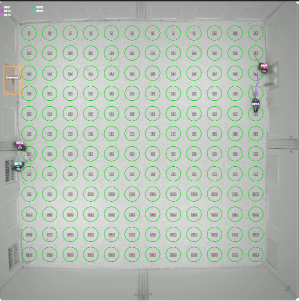

# DeepLabCut 扩展追踪分支（RFID DLC 追踪项目）



本分支在官方 [DeepLabCut](https://github.com/DeepLabCut/DeepLabCut) 基础上扩展了追踪能力，主要包含：

- **速度门控椭圆追踪器**：通过速度与空间的双重门控预测并拒绝不合理匹配，在动物快速移动或交叉时仍能保持身份稳定。
- **RFID 辅助的长期追踪**：在场地周围布设读卡器周期性校正身份，即便长时间遮挡也能维持准确追踪。

所有功能与标准 DeepLabCut 项目和 API 兼容，更多使用教程可参见官方文档。

## 使用手册

### 安装与环境准备

```bash
git clone https://github.com/Chap5732/DeepLabCut.git
cd DeepLabCut
git checkout feat/velocity-gating
pip install -e .
```

### 项目结构

```
deeplabcut/rfid_tracking/
├── config.py                # 默认路径与门控参数
├── pipeline.py              # 串联各处理步骤的主流程
├── run_pipeline.py          # 命令行运行完整流程
├── match_rfid_to_tracklets.py
├── reconstruct_from_pickle.py
├── make_video.py
├── convert_detection2tracklets.py
├── scripts/                 # 示例脚本
└── ...
```

### 核心脚本

- `run_pipeline.py` / `run_rfid_pipeline`：一键完成分析，依次调用 DLC 推理、RFID 匹配、轨迹重建与视频生成。
- `match_rfid_to_tracklets.py`：依据 RFID 读卡器记录为 tracklet 分配标签。
- `reconstruct_from_pickle.py`：以带标签 tracklet 为锚点重建连续身份链。
- `make_video.py`：在原视频上叠加轨迹、标签和 ROI 等可视化信息。

### 快速开始

1. 在 YAML 中写入数据路径：

```yaml
# paths.yaml
VIDEO_PATH: /path/to/video.mp4
MRT_RFID_CSV: /path/to/rfid.csv
MRT_CENTERS_TXT: /path/to/readers_centers.txt
MRT_TS_CSV: /path/to/timestamps.csv
```

2. 运行完整流程：

```bash
python run_pipeline.py config.yaml video.mp4 rfid.csv readers_centers.txt timestamps.csv \
    --config_override paths.yaml
```

或在 Python 中调用：

```python
from deeplabcut import run_rfid_pipeline

run_rfid_pipeline(
    config_path="config.yaml",
    video_path="video.mp4",
    rfid_csv="rfid.csv",
    centers_txt="readers_centers.txt",
    ts_csv="timestamps.csv",
    destfolder="./outputs",
)
```

### 单步执行

```bash
# 匹配 RFID
python scripts/run_match_rfid.py tracklets.pickle rfid.csv readers_centers.txt timestamps.csv --out-dir rfid_match_outputs

# 轨迹重建
python scripts/run_reconstruct.py tracklets_with_rfid.pickle --pickle-out reconstructed.pickle --out-subdir recon

# 视频生成
python scripts/run_make_video.py video.mp4 reconstructed.pickle readers_centers.txt --output-video overlay.mp4
```

如需仅将检测结果转为 tracklets，可运行：

```bash
python convert_detection2tracklets.py --config-path <项目config.yaml> --video-input <视频或目录>
```

### 配置参数

`config.py` 汇总了常用设置，可通过 YAML 覆盖（`--config_override` 或 `load_config`）。

- **路径**：`PICKLE_IN`、`VIDEO_PATH`、`CENTERS_TXT`、`DESTFOLDER` 等。
- **门控与重建**：`FPS`、`PX_PER_CM`、`V_GATE_CMS`、`MAX_GAP_FRAMES`、`ANCHOR_MIN_HITS` 等。
- **可视化**：`TRAIL_LEN`、`CHAIN_TRAIL_LEN`、`TAG_HOLD_FRAMES`、`MAX_FRAMES` 等。
- **推理配置**：`inference_cfg` 中需指定 `pcutoff`、`topktoretain`、`velocity_gate_cms`、`px_per_cm`、`fps`、`max_px_gate`、`gate_last_position` 等，确保速度/空间门控生效。
- **RFID 匹配**：`MRT_HIT_RADIUS_PX`、`MRT_AMBIG_MARGIN_PX`、`MRT_TAG_MIN_READS`、`MRT_TAG_DOMINANT_RATIO`、`MRT_COIL_DIAMETER_PX` 等。

示例 YAML：

```yaml
PICKLE_IN: /path/to/tracklets.pickle
MRT_RFID_CSV: /path/to/rfid.csv
SHOW_CHAIN: true
DRAW_READERS: false
```

### 数据格式

- **ROI 文件 (JSON)**：每个区域由多边形顶点定义。
- **读卡器中心文件 (TXT/CSV)**：`row, col, x, y` 格式记录各天线的平面坐标。

### 重构改进

1. **集中配置**：新增 `config.py`，统一管理路径与门控参数。
2. **统一工具函数**：共用函数集中在 `utils.py`。
3. **删除冗余**：简化导入逻辑与目录结构。
4. **清晰职责**：脚本各司其职。
5. **改进文档**：补充函数与参数说明。

### 依赖库

- numpy
- pandas
- opencv-python
- pathlib、json（标准库）

### 注意事项

- 使用前请根据实际数据修改 `config.py` 或提供 YAML 覆盖。
- 输入的 pickle 文件需包含正确的 DLC tracklet 数据结构。
- ROI 文件目前仅支持 polygon 类型 JSON。
- 运行 `run_pipeline.py` 或 `convert_detection2tracklets.py` 时，请确认日志中出现 `inference_cfg` 以及 “Velocity gating enabled...” / “Spatial gating enabled...” 提示。

## 原理

### 标签分配

`match_rfid_to_tracklets.py` 将读卡器捕获的标签分配给 tracklet：

1. **时空匹配**：根据 `MRT_RFID_FRAME_RANGE` 对齐到最近视频帧，并在 `MRT_COIL_DIAMETER_PX/2 + MRT_HIT_MARGIN` 半径内查找候选轨迹。
2. **候选筛选**：要求轨迹关键点 `p` 值 ≥ `MRT_PCUTOFF`，并处理多候选歧义。
3. **标签确认**：统计命中次数，命中总数 ≥ `MRT_TAG_MIN_READS` 且主标签占比 ≥ `MRT_TAG_DOMINANT_RATIO` 时确认标签。

### 轨迹重建

`reconstruct_from_pickle.py` 以带标签的 tracklet 为锚点构建身份链：

1. **锚点筛选**：命中次数 ≥ `ANCHOR_MIN_HITS` 的 tracklet 作为锚点并按时间排序。
2. **时间-速度门控**：候选轨迹需满足时间间隔 `≤ MAX_GAP_FRAMES` 且位移 `d ≤ V_GATE_CMS × gap / (FPS / PX_PER_CM)`。
3. **同步推进**：各锚点同时扩展并按代价选择候选，若代价差 < `δ` 判为歧义并等待下一轮。
4. **近锚点堤坝**：同一标签在传播方向上的近邻锚点会阻止越界扩张，避免跨越可靠锚点。

经过多轮推进即可得到连续、无冲突的身份链，可用于后续可视化与行为分析。

